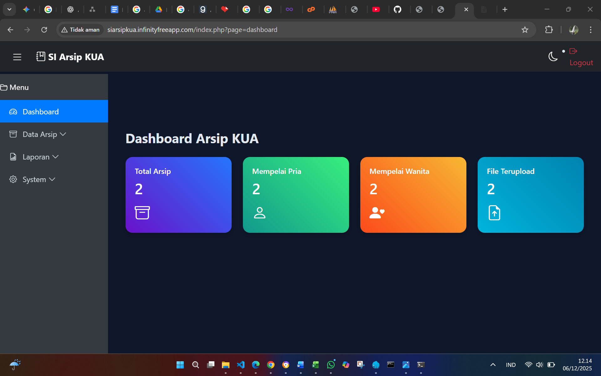
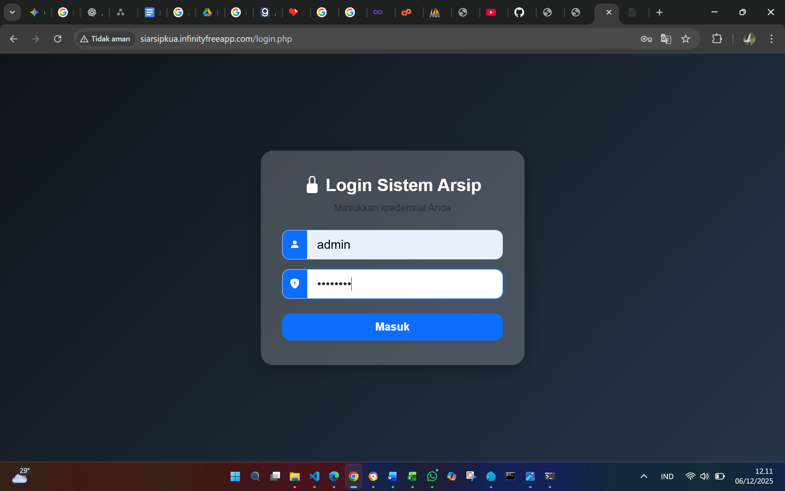

🚀 Final Project RPL — SI ARSIP KUA
👥 Identitas Kelompok

Kelompok 8 — 5B Sistem Informasi

| Nama Anggota | NIM | Tugas / Jobdesk |
| :--- | :--- | :--- |
| **Achmad Reza Dzurryyatul Asy'ari** | 701230011 | Membuat ERD, Activity Diagram, Class Diagram, Mengembangkan aplikasi SI Arsip KUA menggunakan PHP Native, Final integrasi & video demo |
| **One Azizah** | 701230076 | Deployment hosting ke InfinityFree, testing aplikasi, dokumentasi project, pembuatan slide presentasi |
| **Nanda Septa Lian Sari** | 701230043 | Penyusunan dokumen SRS lengkap, Analisis kebutuhan sistem (Requirement Analysis) |

## 📱 Deskripsi Singkat Aplikasi
**SI ARSIP KUA** adalah aplikasi berbasis web yang digunakan untuk digitalisasi dan pengarsipan buku nikah di Kantor Urusan Agama. Sistem ini dirancang untuk mempermudah penyimpanan, pencarian, manajemen data, dan pencetakan laporan akta nikah.

🎯 Tujuan Sistem
Permasalahan

Arsip akta/buku nikah masih dilakukan secara manual berbentuk kertas

Resiko hilang, rusak, dan sulit dicari

Tidak adanya sistem pelaporan arsip secara otomatis

Solusi

Menyediakan database digital arsip buku nikah

Memungkinkan upload dan download file scan akta nikah

Menyediakan laporan arsip PDF & Excel

Menyediakan pencarian cepat & filter data

Menyediakan log aktivitas pengguna

## 🛠 Teknologi yang Digunakan

### Backend
* **Bahasa:** PHP 8.1 (Native)
* **Database:** MySQL 8.0
* **Driver:** PDO (Prepared Statement)
* **Auth:** Session Authentication

### Frontend
* HTML5, CSS3, JavaScript
* Bootstrap 5
* SweetAlert2
* Icons Bootstrap

### Security
* Password hashing (`password_hash()`)
* Input validation

📱 Fitur Utama Aplikasi
👨‍💼 Admin & Petugas
Fitur	Status
Login Sistem	✅
Manajemen Arsip Buku Nikah (CRUD)	✅
Upload & Download Scan Akta (PDF/JPG/PNG)	✅
Filter Data & Pencarian	✅
Export Laporan PDF & Excel	🧾 PDF / XLS
Log Aktivitas Sistem	📌 Tersedia
Mode tampilan Grid / List	🎨
Auto Dark Mode	🌙
Dashboard Statistik Arsip	📊
🔐 Akun Demo
Role	Username	Password
Admin	admin	admin123
🚀 Cara Menjalankan Aplikasi
Instalasi

Download project ke:

C:\laragon\www\si_arsip_kua\

atau

C:\xampp\htdocs\si_arsip_kua\

Buka phpMyAdmin
Buat database:

si_arsip_kua

Import file:

si_arsip_kua.sql

Konfigurasi koneksi database di config.php

$host = 'localhost';
$dbname = 'si_arsip_kua';
$username = 'root';
$password = '';

Jalankan server dan akses:

http://siarsipkua.infinityfreeapp.com/login.php

📄 Screenshot Halaman Aplikasi

Dashboard Arsip

### Halaman Login

Login Page

### Halaman Login

📚 Keterangan Tugas RPL
Item	Status
SRS (Software Requirement Specification)	✔
ERD, Activity Diagram, Class Diagram	✔
Implementasi Database MySQL	✔
Implementasi Web App	✔
Testing	✔
Dokumentasi & Video Presentasi	✔
💡 Pengembangan Selanjutnya

 Sistem tanda tangan digital KUA / pejabat

 Verifikasi file dengan QR Code

 fitur autentikasi multi-role secara penuh

 Backup database otomatis

 Notifikasi email

🎓 Informasi Kursus

Mata Kuliah: Rekayasa Perangkat Lunak
Dosen Pengampu: Dila Nurlaila, M.Kom
Program Studi: Sistem Informasi — UIN STS Jambi

📝 Penutup

Aplikasi ini dibangun untuk membantu digitalisasi arsip buku nikah agar data lebih aman, mudah dicari, dan efisiensi kerja meningkat.

Dibuat dengan sepenuh hati ❤️ oleh Kelompok 8 — SI 5B UIN STS Jambi
